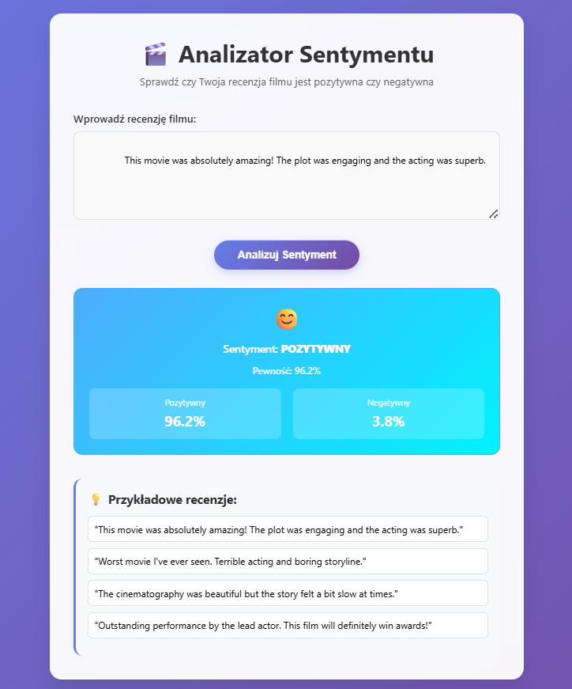
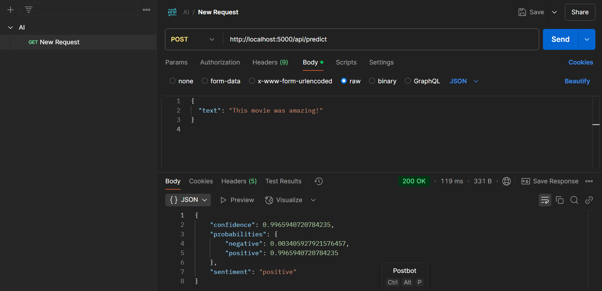

# Analizator Sentymentu Recenzji Filmowych

Aplikacja internetowa do automatycznej analizy sentymentu recenzji filmowych z wykorzystaniem technik NLP oraz Machine Learning

##  Instalacja

### 1. Uruchomienie z Dockera
```bash
git clone https://github.com/xaqexa/movie-sentiment.git
cd movie-sentiment
docker-compose up --build
```

##  Struktura plików

```
projekt/
├── sentiment_analyzer.py
├── app.py
├── requirements.txt
├── README.md
├── templates/
│   └── index.html
├── IMDB.csv 
├── preprocessed.csv (zostanie utworzony automatycznie)
└── sentiment_model.pkl (zostanie utworzony po treningu)
```

##  Użycie

### Pierwsze uruchomienie (trenowanie modelu)

1. **Jeśli jest plik IMDB.csv:**

   ```bash
   python sentiment_analyzer.py
   ```

2. **Jeśli jest już plik preprocessed.csv:**
   Skrypt automatycznie go wykryje i użyje.

### Uruchamianie aplikacji webowej

```bash
python app.py
```

Aplikacja będzie dostępna pod adresem: [http://localhost:5000](http://localhost:5000)

##  Funkcjonalności

### Analizator (sentiment\_analyzer.py)

* Automatyczne wykrywanie preprocessed.csv
* Przetwarzanie danych IMDB
* Trenowanie modeli ML (Logistic Regression, Naive Bayes, Random Forest)
* Optymalizacja hiperparametrów
* Zapisywanie/ładowanie wytrenowanego modelu

### Aplikacja webowa (app.py)

* Intuicyjny interfejs użytkownika
* Analiza sentymentu w czasie rzeczywistym
* API endpoint dla zewnętrznych aplikacji
* Wyświetlanie prawdopodobieństw



## API

### POST /predict

Formularz HTML dla interfejsu użytkownika.

### POST /api/predict

JSON API dla zewnętrznych aplikacji:

**Request:**

```json
{
    "text": "This movie was amazing!"
}
```

**Response:**

```json
{

    "confidence": 0.9965940720784235,
    "probabilities": {
        "negative": 0.003405927921576457,
        "positive": 0.9965940720784235
    },
    "sentiment": "positive"

}
```


## Interfejs użytkownika

Aplikacja webowa oferuje:

* Nowoczesny, responsywny design
* Przykładowe recenzje do testowania
* Wizualizację pewności predykcji
* Animacje i efekty wizualne
* Obsługę błędów

## Model

Aplikacja używa:

* **TF-IDF** do wektoryzacji tekstu
* **Logistic Regression** jako główny model
* **Selekcję cech** (SelectKBest) dla optymalizacji
* **GridSearchCV** do tuningu hiperparametrów

## Preprocessing

Dane są przetwarzane przez:

1. Usunięcie duplikatów i pustych recenzji
2. Czyszczenie HTML i znaków specjalnych
3. Lematyzację z użyciem spaCy
4. Usunięcie stop words
5. Tokenizację

## Wydajność

Model osiąga typowo:

* **Accuracy**: \~85-90%
* **F1-score**: \~85-90%
* **Czas predykcji**: <1 sekunda

## Aktualizacja modelu

Aby przetrenować model z nowymi danymi:

1. Usuń plik `sentiment_model.pkl`
2. Uruchom `python sentiment_analyzer.py`

## Uwagi

* Model jest trenowany na danych IMDB w języku angielskim
* Najlepsze wyniki dla recenzji filmowych
* Aplikacja korzysta z folderu `templates/`, który zawiera pliki HTML.
* Model jest zapisywany automatycznie po treningu

## Przykłady użycia

### Pozytywne recenzje:

* "This movie was absolutely fantastic!"
* "Amazing acting and brilliant storyline"
* "Best film I've seen this year"

### Negatywne recenzje:

* "Worst movie ever, terrible acting"
* "Boring and predictable plot"
* "Complete waste of time"
